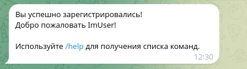
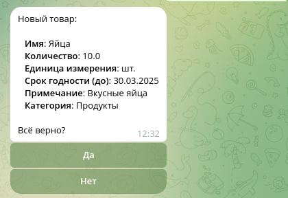
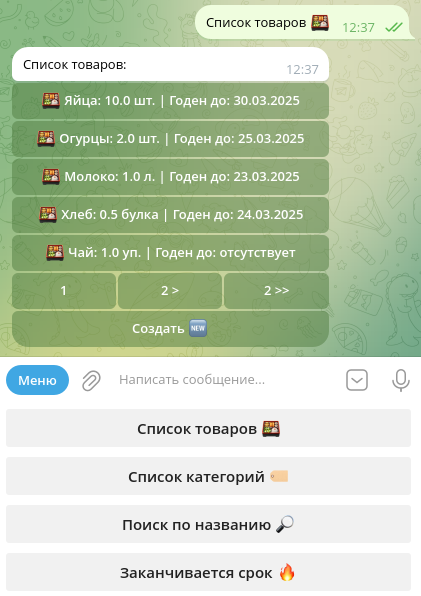
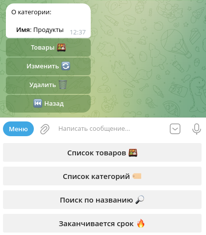
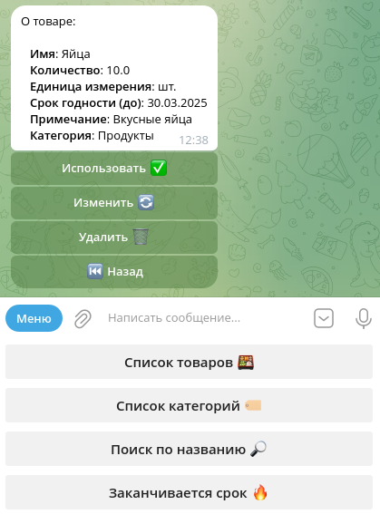
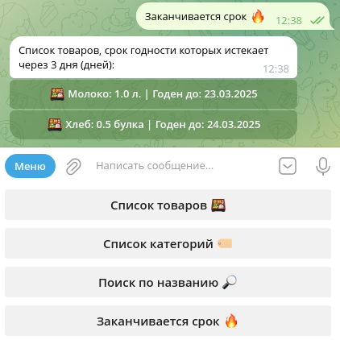
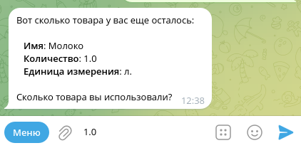
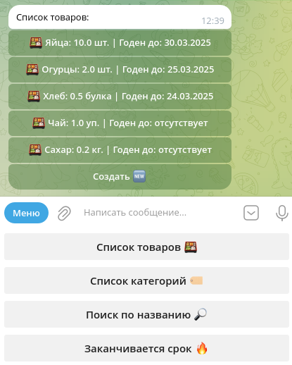

# CATalog
Исполнитель: **Юрий Кожанов**

-------------------------------------------------------------------------------------

## Содержание
1. [Описание](#описание-проекта)
2. [Установка](#установка-и-запуск)
3. [Скриншоты](#скриншоты-работающего-приложения)
4. [Инструменты](#используемые-инструменты)
5. [Контакты](#контакты)

## Описание проекта
Домашний каталог с базовыми возможностями. Frontend часть реализована как телеграм бот.

Возможности пользователя в телеграм боте:
- Создать категорию товара
- Редактировать категорию товара
- Удалить категорию товара (сохранить / удалить связанные товары)
- Получить список товаров в категории
- Создать товар
- Редактировать товар
- Использовать товар (при полном использовании товар удаляется)
- Удалить товар
- Получить список всех категорий
- Получить список всех товаров
- Получить список товаров по названию
- Получить список товаров у которых заканчивается скор годности

Приложение запускается через Docker Compose и не теряет данные между перезапусками (данные хранятся в PostgreSQL).

## Установка и запуск
### Шаг 1: Предварительная настройка
Перед использованием приложения убедитесь, что на Вашем устройстве (Linux-based OS) установлен **Docker 28.0.1**

### Шаг 2: Клонируйте репозиторий
Клонируйте github репозиторий на Ваше устройство:
```bash
git clone https://github.com/ykozhanov/CATalog.git
```

### Шаг 3: Настройка переменных окружения
- Перейдите в директорию с репозиторием:
```bash
cd CATalog
```
- Создайте `.env` файл с переменными. Для примера используйте `.env-example` из репозитория.

- Для генерации RSA ключей можете использовать команды:
    - `openssl genrsa -out jwt-private.pem 2048`
    Эта команда генерирует закрытый ключ RSA длиной 2048 бит и сохраняет его в файл jwt-private.pem.
    
    - `openssl rsa -in jwt-private.pem -outform PEM -pubout -out jwt-public.pem`
    Эта команда извлекает открытый ключ из ранее сгенерированного закрытого ключа, который хранится в файле jwt-private.pem.

### Шаг 4: Docker-Compose
- Для запуска выполните в терминале: 
```bash 
docker compose up
```

### Шаг 5. Применение миграций
После запуска всех контейнеров (ориентируйтесь на celery-контейнер) примените миграции к базе данных.
Для этого выполните скрипт `migrate.sh` из директории `alembic` (Предварительно установив библиотеку alembic на устройство).

**Важно**: Запускать скрипт необходимо из директории `alembic`.


## Скриншоты работающего приложения
**Регистрация**


***

**Создание нового товара**


***

**Список товаров**


***

**Список категорий**


***

**Информация о категории**


***

**Информация о товаре**


***

**Список товаров у которых заканчивается срок годности**


***

**Использование товара**


***

**Полное использование товара**


***

**Список товаров без полностью использованного товара**


***


## Используемые инструменты
- [Python](https://www.python.org/) как основной язык программирования;
- [FastAPI](https://flask.palletsprojects.com//) как backend сервиса;
- [PostreSQL](https://www.postgresql.org/) как база данных;
- [SQLAlchemy 2.0](https://www.sqlalchemy.org/) как ORM инструмент;
- [Alembic](https://alembic.sqlalchemy.org/en/latest/) как инструмент миграций базы данных;
- [Celery](https://docs.celeryq.dev/) как инструмент выполнения фоновых задач (уведомлений о товарах у которых заканчивается срок годности).


## Контакты
По вопросам проекта и другим вопросам связанным с используемыми в проекте инструментам 
можно писать на почту `ykozhanov97@gmail.com`